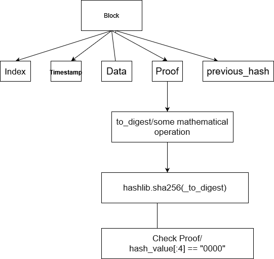

### Steps 
* Create genesis block ( initial block )
* mine block  
    * get previous block 
    * create proof of work 
      * create digest 
        * digest is some mathematical operation against data 
        * hash the value of the digest
        * validate 
        * return proof of work
    * hash previous block
    * create new block add it to list

